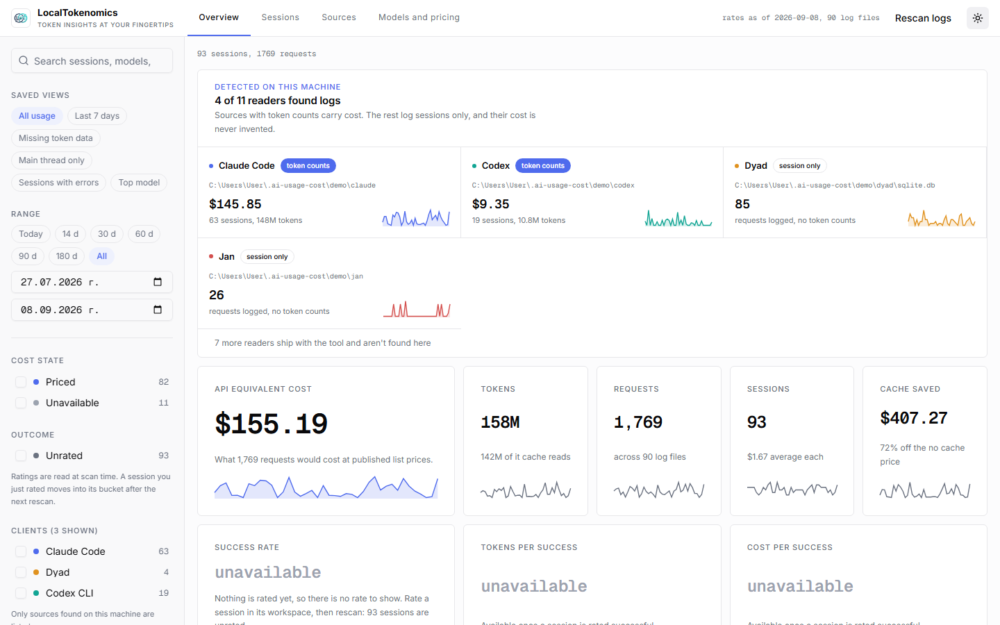
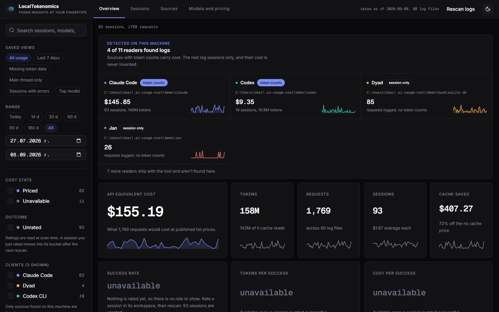
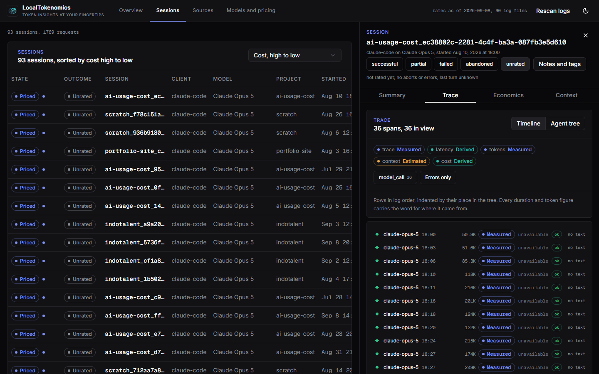

<p>
  
</p>

# LocalTokenomics

### Token insights at your fingertips.

LocalTokenomics (command name: `ai-usage-cost`) is a local, read-only tool that reads the log
files and data stores that AI coding tools already write on your machine, whatever those
tools happen to be: Claude Code, Codex, Ollama, Jan, Dyad, GitHub Copilot Chat, Google
Antigravity, Cursor, Windsurf, Grok Build, and any OpenAI-compatible gateway export. It turns
that raw usage into what it would have cost at published API list prices, broken down by
provider, client, model, and project. You can read the result in the terminal or open a local
dashboard, which shows only what you actually use by default and keeps everything else one
click away rather than hidden.

For the sources that log enough detail, it also reconstructs what actually happened inside a
session: the chronological trace of model calls, tool calls and results, what each turn cost
and how long it took, and how the context window filled up. Every number carries a label
saying where it came from, so a measured value never looks like a guess and a missing one is
never shown as a zero.

Everything runs offline and read-only. No API key is needed, nothing is uploaded, and no
network call is ever made to price your usage.

```
$ ai-usage-cost scan
╭─────────────────────────────── Total ────────────────────────────────╮
│ API-equivalent cost for everything logged on this machine            │
│ Broken down by requests, log files, and the rates used for pricing   │
╰──────────────────────────────────────────────────────────────────────╯
```

The dashboard, in both themes (screenshots taken against synthetic demo data generated by
`ai-usage-cost demo`, not a real machine's logs):

<p>
  
  
</p>

Opening a session shows its trace, economics and context, each value labelled with where it
came from:

<p></p>

## Features

- **Cost, without a subscription bill to compare against.** Every request is priced at
  published API list rates from `rates.json`, broken down by provider, client, model, and
  project, with cache and batch discounts applied per provider.
- **Recency aware by default.** The dashboard shows the clients you actually use and your top
  projects, not a wall of every tool and folder it has ever seen. Everything else stays one
  click away in a collapsed panel, never hidden outright.
- **Session traces, not just totals.** For sources that log enough detail, replay the exact
  chronological sequence of model calls, tool calls, retries, and subagent branches inside one
  session, each with a cost and duration.
- **Nothing is guessed at.** Every number is labelled measured, derived, estimated, or
  unavailable. A cost that cannot be known is shown as the word `unavailable`, never as `$0.00`.
- **Ten plus sources out of the box**, auto-discovered from a single module per source, so
  adding one more is a small, self-contained change, not a rewrite.
- **Fully local.** No API key, no account, no network call to price anything. The SQLite store
  and the rate table both live on your machine.
- **A terminal path for everything the dashboard shows**: `scan`, `export`, and an optional
  Textual `tui`, for anyone who would rather not open a browser.

## Requirements and installation

You need Python 3.11 or newer. Install with `uv` (recommended, and it can provision its own
Python so you don't need one already on the system) or plain `pip` (needs a 3.11+
interpreter already on PATH). Works the same way on Windows, Linux and macOS; the commands
below differ only in how each platform gets `uv` or a recent enough Python onto PATH.

**Windows:**

```powershell
uv tool install git+https://github.com/GeorgiNaydenov/AI-Token-Usage-Tracking
```

```powershell
# plain pip, if you'd rather not use uv
pip install "git+https://github.com/GeorgiNaydenov/AI-Token-Usage-Tracking"
```

**Linux:**

```bash
curl -LsSf https://astral.sh/uv/install.sh | sh   # installs uv, if you don't have it
uv tool install git+https://github.com/GeorgiNaydenov/AI-Token-Usage-Tracking
```

```bash
# plain pip, if you'd rather not use uv, needs Python 3.11+ already on PATH
python3 --version   # Ubuntu 24.04+/Debian 12+ ship 3.11+; Ubuntu 22.04 ships 3.10, get a
                     # newer interpreter first: sudo add-apt-repository ppa:deadsnakes/ppa
                     # && sudo apt install python3.11
pip install --user "git+https://github.com/GeorgiNaydenov/AI-Token-Usage-Tracking"
```

**macOS:**

```bash
curl -LsSf https://astral.sh/uv/install.sh | sh   # or: brew install uv
uv tool install git+https://github.com/GeorgiNaydenov/AI-Token-Usage-Tracking
```

```bash
# plain pip, if you'd rather not use uv: macOS's own python3 is often too old or absent
brew install python@3.11
python3.11 -m pip install --user "git+https://github.com/GeorgiNaydenov/AI-Token-Usage-Tracking"
```

Or from a clone, on any platform:

```bash
uv venv && uv pip install -e ".[png,dev]"
```

The `[png]` extra adds the Matplotlib exporter used by `ai-usage-cost export report.png`.
The `[dev]` extra adds the test and lint tools used in Development below. Neither is
required just to scan and price your logs. `[sql]`, `[alert]` and `[tui]` are three more
optional extras, covered in Optional integrations below.

The dashboard's static assets are already built and committed to the repository, so
installing and running `ai-usage-cost serve` works with Python alone on any of the three
platforms: you do not need Node.js. Node.js 20 or newer and npm are only required if you are
working from a clone and changing the dashboard's frontend source under `web/`, since that is
a separate client application that has to be rebuilt after any change (see Local development
below).

## Running it

```bash
ai-usage-cost scan                           # terminal summary, broken down by model
ai-usage-cost scan --by client                # or: provider, model, project, day
ai-usage-cost scan --since 2026-08-01 --no-sidechains -v
ai-usage-cost serve                           # dashboard at http://127.0.0.1:8420
ai-usage-cost demo                            # dashboard on generated logs, not your own
ai-usage-cost export report.json              # or report.png
ai-usage-cost collect --tdp-watts 225         # sample local GPU use while a model runs
```

Point a source at logs elsewhere with `--root SOURCE=PATH` (repeatable), for example
`--root claude-code=/tmp/demo/claude --root openai-compat=/tmp/gateway-logs`. `--db PATH`
picks a different SQLite store, and `--rebuild` discards it and reparses everything from
scratch.

## Try it without your own logs

```bash
ai-usage-cost demo          # on: generate fake logs, then open the dashboard on them
ai-usage-cost demo --off    # off: delete them, then open the dashboard on your own logs
```

The demo is synthetic: it generates sessions under `~/.ai-usage-cost/demo/` and serves
them from a store of their own, so it never reads or writes your real logs or your real
store at `~/.ai-usage-cost/usage.db`. Every number it shows is made up. A second `demo`
run reuses what is already there; `--off` removes it and puts you straight back on your
own data. Plain `scan` and `serve` are unaffected: they always read only your machine.

## Optional integrations

Three commands wrap a third-party tool. Each sits behind its own extra and is imported
only when you run it, so an install without them costs nothing; run one anyway and it
prints the exact install line instead of a traceback. All three still read only local
files.

### Ad-hoc SQL (`[sql]`)

```bash
uv pip install "ai-usage-cost[sql]"
ai-usage-cost sql                            # Datasette at http://127.0.0.1:8421
```

Opens [Datasette](https://datasette.io) on the same SQLite store the dashboard reads
(`--db PATH` for another one), for the questions the curated views don't answer: the
`requests` and `files` tables raw, arbitrary joins and group-bys, CSV/JSON export of
whatever you select. Datasette's query interface accepts `SELECT` only, so this is
read-only exploration of a file on your own machine and nothing leaves it. Run `scan` or
`serve` at least once first, since `sql` reads the store rather than building it.

### Spend alerts (`[alert]`)

```bash
uv pip install "ai-usage-cost[alert]"
ai-usage-cost alert --to "ntfy://ntfy.sh/my-topic" --over 25 --days 7
ai-usage-cost alert --to "slack://tokens/#costs" --rise-over 10 --days 7
```

Prices the last `--days` days (default 1, ending today) and, when the amount clears the
threshold, sends one notification through [Apprise](https://github.com/caronc/apprise),
which covers Slack, ntfy, Discord, email and around a hundred others; `--to` is repeatable. Pass
exactly one threshold: `--over` compares the window's own total, `--rise-over` compares
the rise against the preceding window of the same length. The message names which of the
two it compared, so neither figure is ambiguous. There is no daemon: pair it with cron or
Task Scheduler. It prints the message it would send and exits 0 whether or not it fired,
so a quiet run is not a failure; a non-zero exit means an unusable target or a delivery
that failed.

The figure is priced requests only, and the message says what it left out: unpriced
models and sessions whose logs carry no token counts are named as excluded, never folded
in as $0. Both counts cover the same window as the cost.

### Terminal UI (`[tui]`)

```bash
uv pip install "ai-usage-cost[tui]"
ai-usage-cost tui --since 2026-08-01
```

A [Textual](https://textual.textualize.io) table of every session, with columns for
start, client, project, models, requests, tokens, cost and cost state. Click a column header to sort by it
and again to reverse, type in the box to filter, `q` to quit. The same numbers `scan` and
`serve` show, without a browser or a server.

## Where it reads

| Source | Client(s) | Path | Token data |
|---|---|---|---|
| Claude Code | `claude-code` | `~/.claude/projects/*/*.jsonl` | full |
| Codex | `codex-cli`, `codex-desktop` | `~/.codex/sessions/**/rollout-*.jsonl` | full |
| Ollama app | `ollama-app` | Windows `%LOCALAPPDATA%\Ollama\db.sqlite`; macOS `~/Library/Application Support/Ollama/db.sqlite`; Linux `~/.config/Ollama/db.sqlite` or `~/.local/share/Ollama/db.sqlite` | none, session only |
| Jan | `jan` | `~/jan/threads`; else Windows `%APPDATA%\Jan\data\threads`, macOS `~/Library/Application Support/Jan/data/threads`, Linux `~/.local/share/Jan/data/threads` | none, session only |
| Dyad | `dyad` | Windows `%APPDATA%\dyad\sqlite.db`; macOS `~/Library/Application Support/dyad/sqlite.db`; Linux `~/.config/dyad/sqlite.db` | none, session only |
| GitHub Copilot Chat | `copilot-chat` | `<vscode-data>/User/globalStorage/github.copilot-chat/session-store.db` (checks VS Code, Insiders and VSCodium) | none, session only |
| Google Antigravity | `antigravity` | `~/.gemini/antigravity/brain/*/.system_generated/logs/transcript*.jsonl` | none, session only |
| Cursor | `cursor` | `<vscode-data>/User/globalStorage/state.vscdb` and every `<vscode-data>/User/workspaceStorage/*/state.vscdb` | none, session only |
| Windsurf | `windsurf` | same `state.vscdb` layout as Cursor | none, session only |
| Grok Build | `grok-build` | `$GROK_HOME/sessions/**/updates.jsonl`, default `~/.grok` | full |
| OpenAI-compatible | `openai-compat` | none by default, pass `--root openai-compat=PATH` | full, when the log has `usage` |

`~` is your home directory: `%USERPROFILE%` on Windows, `$HOME` on Linux and macOS.
`<vscode-data>` is `%APPDATA%` on Windows, `~/Library/Application Support` on macOS, and
`~/.config` on Linux. Every reader checks every path it might plausibly find data at, in the
order listed, and uses the first one that exists, so you don't need to know which one applies
to you.

Claude Code's and Codex's paths are identical on all three platforms: both tools always write
under your home directory the same way regardless of OS, so there is nothing to translate for
them. Most clients log that a session happened but not its token counts. The Cost states
section below explains how that is represented honestly instead of hidden or guessed at.

Cursor, Windsurf and Grok Build ship readers, but none of the three were verified against a
real install: this machine had none of them to test against. Cursor's `state.vscdb` layout was
cross checked against several independent open source readers and is reasonably solid; Windsurf's
chat data key is a best effort guess with no independent confirmation; Grok Build's format was
matched against a real open source adapter's fixtures. Every one degrades to zero events rather
than failing if it turns out to be wrong, the same as every other source with nothing installed.

What each source supports beyond cost:

| Source | Trace | Latency | Context window |
|---|---|---|---|
| Codex | full | measured | measured, and it logs its compactions |
| Claude Code | full, with an exact subagent tree | derived from timestamps | estimated from the rate table |
| Antigravity | full, typed steps | derived from timestamps | not recorded |
| Everything else | not supported | not recorded | not recorded |

## How cost is worked out

### Cost states

Every request lands in exactly one state, shown per session in both the dashboard and the
CLI:

| State | Meaning |
|---|---|
| `priced` | Has a matching rate in `rates.json`. Counted in every total. |
| `free` | The provider is marked free, such as a local model runtime. Counted at $0.00. |
| `unpriced` | Token counts exist, but no rate entry matches the model. Listed with its token count and left out of cost totals until a price is added. |
| `unavailable` | The client's log carries no token counts at all. The request and session are still counted; cost is never invented. |

A model is never silently priced at zero.

### Token buckets and multipliers

Tokens are normalized into four disjoint billable buckets: uncached input, cache read,
cache write, and output. Each is priced from `src/ai_usage_cost/rates.json`, and the cache
and batch multipliers apply to a model's base input price:

| Bucket | Typical multiplier |
|---|---|
| Cache read | around 0.1x, varies by provider |
| Cache write, short TTL | around 1.25x, varies by provider |
| Cache write, long TTL | around 2.0x, varies by provider |
| Batch tier | around 0.5x on everything, when the provider offers one |

The exact multiplier for each provider is set in `rates.json`, since not every vendor
prices caching or batching the same way, and some do not offer either at all.

### Provider and model coverage

Rates are tracked per model in `rates.json`, covering every major hosted provider,
including Anthropic, OpenAI, Google, xAI, DeepSeek, Moonshot, Alibaba, Zhipu, Mistral,
MiniMax, and Amazon, alongside free local runtimes. The table is plain data you edit
yourself; see Editing rates below for how to add or correct a model.

### Provider resolution

The provider billing a request is resolved in order: an adapter that already knows who is
billing declares it directly, then a gateway prefix in the model id (`us.anthropic.` for
Bedrock, `openrouter/` for OpenRouter, and so on), then finally the matched rate entry's
own vendor. `rates.json` is a snapshot, not a live feed. Check its `as_of` field and edit
it whenever you want.

### Worth knowing

- These are list-price equivalents for the tokens you actually spent, not what a
  subscription billed you. The two numbers are not directly comparable.
- Only requests that reached the model and were logged are counted.
- Several sources here, including the Ollama app, Jan, Dyad, Copilot Chat, and
  Antigravity, log sessions but not token counts on real machines. See Cost states above.

## What happened inside a session

Claude Code, Codex and Antigravity log enough to reconstruct the run itself, not just its
token counts. A session opens into a workspace with four tabs:

| Tab | What it answers |
|---|---|
| Summary | What did this session cost, and what were its token buckets |
| Trace | What happened, in order: model calls, tool calls and their results, reasoning, retries, compactions, subagents |
| Economics | Where the tokens, money and time went, per turn, per model and per tool |
| Context | How full the context window was at each model call, and what grew it |

You can rate a session successful, partial, failed or abandoned, with notes and tags. Ratings
are what make cost per successful task meaningful, and they are read at scan time, so a
session you just rated moves into its bucket after the next rescan.

### Where every number comes from

Sources differ enormously in what they record, so each value carries its own provenance:

| Label | Meaning |
|---|---|
| `measured` | Stated outright in the log |
| `derived` | Computed from measured values, such as a duration between two timestamps |
| `estimated` | Based on an assumption, such as a context window taken from the rate table |
| `inferred` | Reconstructed from how records relate to each other |
| `unavailable` | The source does not record it |

This matters most for latency. Codex records real start and end times for its work, so its
durations are measured. Claude Code records none, so its durations are the wall-clock gap
between log records, which includes any time you spent reading before replying. Showing both
in the same column without saying which is which would be the easiest way to make this tool
quietly dishonest, so it always says.

An unavailable value is shown as the word `unavailable`, never as `0`. A zero means a real
zero.

### What it will not claim

Cloud GPU utilisation and energy are not recorded by any of these logs and are never
estimated. Reconstructed context is what the visible log implies, not the exact server-side
context. Hidden reasoning stays hidden. Cursor ships in the source list with every capability
marked unavailable, because its format has not been audited.

## Privacy

Traces contain prompts, source code, command output and whatever a stray environment variable
printed, so nothing of the sort is stored. The database holds only metadata plus a byte offset
into the original log, and content is read back from that log on demand, redacted, and never
written anywhere.

Settings live in `~/.ai-usage-cost/config.json`, next to the store. It is optional; these are
the defaults:

```json
{
  "metadata_only": true,
  "exclude_projects": [],
  "max_content_bytes": 65536,
  "metadata_retention_days": null
}
```

`metadata_only` is on by default, which means the content endpoint refuses to serve anything
at all. Turning it off enables read-through, and content is still redacted first: private
keys, AWS and GitHub and vendor API keys, JWTs, bearer headers, and generic secret
assignments. `exclude_projects` drops a project's traces at ingest time, and a session's
traces can be deleted outright from its workspace, which also stops a rescan bringing them
back. Cost data for an excluded or deleted session is kept, because it contains no content.

## Local compute

`ai-usage-cost collect` samples GPU utilisation and VRAM while a local model runs, so local
inference can be compared against API-priced work. It picks a backend at runtime: `nvidia-smi`
where present, then `rocm-smi`, then Windows performance counters. What each one exposes
differs, and the sample records which was used.

The counter fallback reports utilisation and memory in use but neither total VRAM nor power
draw, so energy is never measured. It is estimated from a `--tdp-watts` figure you supply, and
is absent if you do not supply one; there is no default wattage, because a guessed one would
turn an unknown into a number. Sampling through that fallback costs a few seconds per reading,
so results are honest at the scale of a session, not a single tool call. Every backend is
machine-wide, so a sample covers everything using the GPU, not just the agent.

On Linux and macOS there is currently no fallback once `nvidia-smi` and `rocm-smi` are both
absent from PATH: the performance-counter path is Windows-only, and `collect` exits with "No
GPU sampler available" rather than guessing. The one OS-level source on those platforms,
`powermetrics` on macOS, needs `sudo`, which this tool intentionally never asks for, so that
gap is deliberate rather than an oversight. If you have `nvidia-smi` or `rocm-smi` on PATH on
Linux, `collect` works exactly as it does on Windows.

## Storage

Requests are deduplicated and persisted in a local SQLite store at
`~/.ai-usage-cost/usage.db` (override with `--db`). A scan only reparses files that
changed since the last run, and a file that later disappears keeps its already-stored
rows. Cost itself is never stored: it is computed at read time from `rates.json`, so
editing a price reprices your whole history immediately.

Cross-source deduplication uses each request's own id when the log provides one, such as
a Claude message id or an OpenAI-compatible `id`. When a log has no such id, it falls back
to session plus timestamp plus model plus token total, so the same request logged by two
overlapping tools, for example a Codex CLI rollout and its desktop app's own telemetry, is
still counted once.

## Editing rates

`src/ai_usage_cost/rates.json` is plain data. To add a model:

```json
{"match": "claude-opus-6", "provider": "anthropic", "display": "Claude Opus 6",
 "input": 5.0, "output": 25.0}
```

`match` is a prefix, and the longest matching prefix wins. To mark an entire provider's
models as always free, such as a local runtime, add an entry under `providers`:

```json
{"providers": {"my-provider": {"free": true}}}
```

## Adding another source

`src/ai_usage_cost/sources/base.py` defines the contract every source implements:

```python
class Source:
    id: str
    label: str
    clients: dict[str, str]
    default_roots: Callable[[], list[Path]]
    files: Callable[[Path], list[Path]]
    parse: Callable[[Path, list[str]], Iterator[UsageEvent]]
    token_data: Literal["full", "session"]
    display_path: str
    spans: Callable[[Path, list[str]], Iterator[Span]] | None = None
    capabilities: Capabilities = Capabilities()
```

`spans` and `capabilities` are optional. A source that only knows about token counts leaves
both alone and its capability row says so; one that can reconstruct a timeline implements
`spans` and declares what each value it emits is worth.

A new source is a single module ending in `SOURCE = Source(...)`. Every module under
`sources/` is discovered automatically, so nothing else needs to change once it exists.
The steps:

1. Add `src/ai_usage_cost/sources/<name>.py`, with a `parse(path, warnings)` generator
   that yields `UsageEvent`s, plus the `SOURCE` constant.
2. Add a fixture under `tests/fixtures/<name>/`.
3. Add `tests/test_<name>.py`, asserting the parsed events.

Run `pytest`. The CLI, API, storage, and dashboard all pick up the new source without
further edits.

## Project layout

```
src/ai_usage_cost/
  models.py     UsageEvent, TokenUsage, CostBreakdown, and the cost states (pydantic)
  pricing.py    rate lookup, provider resolution, cost arithmetic
  rates.json    the editable price table
  store.py      SQLite storage: migrations, idempotent ingest, dedup
  sources/      one module per source, the extension point
  trace.py      spans, provenance, and the per-session economics and context derivations
  privacy.py    redaction, the config file, and content read-through
  collect.py    the optional local GPU sampler
  demo.py       generates the synthetic logs behind `ai-usage-cost demo`
  tui.py        the optional Textual session table behind `ai-usage-cost tui`
  aggregate.py  grouping by day, model, client, provider, project, and session
  pipeline.py   the pipeline: ingest, load, price, filter, report
  api.py        FastAPI JSON API and static host for the dashboard
  cli.py        scan, serve, demo, export, collect, sql, alert, and tui
  render/       terminal output (rich) and PNG export (matplotlib)
web/            the dashboard's frontend source, built separately and committed as static assets
```

## Local development

```bash
pytest
ruff check src tests
mypy src

python scripts/demo_logs.py /tmp/demo      # writes synthetic logs to develop against
ai-usage-cost serve --root claude-code=/tmp/demo/claude --root codex=/tmp/demo/codex \
  --root jan=/tmp/demo/jan --root dyad=/tmp/demo/dyad/sqlite.db --db /tmp/demo/usage.db

cd web && npm install && npm run build     # writes into src/ai_usage_cost/web/dist
```

The built dashboard bundle is committed to the repository, so `ai-usage-cost serve` works
for anyone who installs the tool without Node.js. You only need to run the build step
above if you are changing the dashboard's frontend source yourself.
